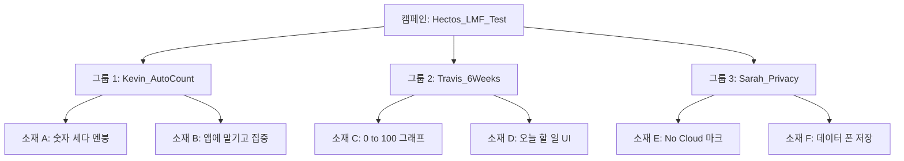

# Hectos 캠페인 마스터 플랜 v1

---

## 👨‍💼 [대표님을 위한 3줄 요약]

1. **목표**: Hectos의 핵심 가설 3가지(숫자 해방/6주 완성/프라이버시)를 실제 시장에서 검증합니다.
2. **예산**: 머신러닝 최적화 최소 요건인 **주 10만 원(일 1.5만 원)**으로 1주일간 테스트합니다.
3. **기대 결과**: 목표 CPI(설치당 단가) ₩2,000 이하인 **'Winning Message'**를 발굴하여, 향후 마케팅의 기준점으로 삼습니다.

---

## 1. 캠페인 개요

- **캠페인명**: `20260118_Hectos_Validation_Phase1`
- **매체**: Meta Ads (Facebook & Instagram)
- **기간**: 2026-01-20 ~ 2026-01-26 (7일간)
- **타겟**:
  - 위치: 미국 (US)
  - 연령: 20-45세 (Broad Targeting 권장)
  - 성별: 남성 (Kevin/Travis 위주, 단 Privacy 소재는 All)
  - 관심사: Home workout, Calisthenics, Push-up (단, Broad가 기본)

---

## 2. 목표 지표 (Success Metrics)

| 구분 | 지표 | 목표(Benchmark) | 설정 이유 |
|------|------|-----------------|-----------|
| **Primary** | **CPI (Cost Per Install)** | **≤ ₩2,000 ($1.5)** | 유틸리티 앱 평균 단가 기준. 이보다 낮아야 확장(Scale-up) 가능. |
| **Secondary** | **CTR (Click-Through Rate)** | **≥ 1.5%** | 소재의 매력도 판단. CPI가 높아도 CTR이 높으면 타겟팅/앱스토어 최적화 문제일 수 있음. |
| **Guardrail** | **D1 Retention** | **≥ 30%** | 잘못된 타겟(허수) 유입 방지. 설치만 하고 바로 지우는 유저가 많으면 실패. |
| **중단 기준** | **CPI > ₩3,000 ($2.2)** | 벤치마크 대비 50% 이상 악화 시 해당 소재 즉시 중단 (Budget Saver). |

---

## 3. 예산 역산 (Budget Backsolve)

Meta 광고 알고리즘이 학습(Learning Phase)을 완료하기 위한 최소 조건을 기반으로 예산을 설정합니다.

- **필요 전환 수**: 주간 50건 (머신러닝 권장 최소치)
- **예상 CPI**: ₩2,000
- **최소 주간 예산**: 50건 × ₩2,000 = **₩100,000**
- **일일 예산**: 약 **₩15,000**

> **전략적 판단**: 3개의 가설을 동등하게 테스트하기 위해, **각 광고 세트(Ad Set)당 일 ₩15,000**을 배정하여 공정한 경쟁을 유도합니다. (총 일 예산 ₩45,000 권장)

---

## 4. 광고 구조 설계 (ABO)

머신러닝이 특정 소재에만 예산을 몰아주는 것을 방지하기 위해 **ABO(Ad Set Budget Optimization)** 방식을 채택합니다.

- **캠페인**: 앱 설치 목적 (App Promotion)
- **광고 세트 (Ad Set)**:
  - **Set 1 (H01)**: `Kevin_AutoCount` (타겟: 운동/홈트 관심) / 예산: 일 ₩1.5만
  - **Set 2 (H03)**: `Travis_6Weeks` (타겟: 챌린지/자기계발 관심) / 예산: 일 ₩1.5만
  - **Set 3 (H06)**: `Sarah_Privacy` (타겟: 테크/프라이버시 관심) / 예산: 일 ₩1.5만

---

## 5. 소재 & 카피 베리에이션 계획

### Set 1: H01 (Kevin x 자동 카운팅)
- **Key Message**: "숫자는 앱이 세줍니다."
- **Copy A (Direct)**: "I keep losing count." (숫자 세다 까먹는 고통스러운 상황) vs "Let Hectos count for you."
- **Copy B (Benefit)**: "Focus on your muscles, not the numbers."
- **Copy C (Feature)**: "Touchless AI Counter. Just place your phone down."

### Set 2: H03 (Travis x 6주 완성)
- **Key Message**: "0 to 100. 6 Weeks."
- **Copy A (Challenge)**: "Can you do 100 pushups? Give us 6 weeks."
- **Copy B (Pain)**: "Plateaued at 30? Break through with Hectos."
- **Copy C (System)**: "Beginner to Advanced. Your personalized roadmap."

### Set 3: H06 (Sarah x Privacy)
- **Key Message**: "Your data stays on your phone."
- **Copy A (Trust)**: "No Cloud. No Upload. 100% On-device AI."
- **Copy B (Comparison)**: "Other apps sell your data. We don't."
- **Copy C (Technical)**: "Private AI Coach. Secure & Offline."

---

## 6. 세팅 체크리스트

- [ ] **MMP/SDK**: Expo `react-native-fbsdk-next` 설치 및 `App Install` 이벤트 연동 확인.
- [ ] **ATT (iOS)**: `requestTrackingPermission` 팝업 시점 최적화 (온보딩 후 노출).
- [ ] **UTM**: `utm_source=meta`, `utm_campaign=lmf_test`, `utm_content={ad_name}` 설정.
- [ ] **Store Page**: 앱스토어 스크린샷 1, 2번에 "AI 카운팅"과 "프라이버시" 메시지 반영.
- [ ] **결제**: 광고 계정 결제 수단 등록 및 한도 설정.

---

*Created: 2026-01-18*
